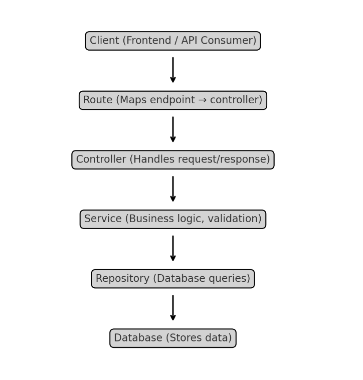

# 🌍 DDD Architecture Guide for Node.js/TypeScript Projects

We follow a **Layered Architecture** (inspired by Clean Architecture & DDD) to keep code **modular, testable, and maintainable**.
Each feature (like `user`, `order`, `product`) follows the same structure.

---

## 📂 Folder Structure (per feature)

```
feature/
 ├── feature.model.ts      → Data schema / type definitions
 ├── feature.repos.ts      → Database queries (Repository)
 ├── feature.service.ts    → Business logic (Service)
 ├── feature.controller.ts → HTTP layer (Controller)
 ├── feature.route.ts      → API endpoints (Router)
 └── feature.provider.ts   → Dependency wiring (Provider)
```

---

## 🧩 Layer Responsibilities

### 1. **Model Layer**

* Defines **data structures** and types.
* No logic, just shapes.
* Example: DB schema, TypeScript interface, DTO.

---

### 2. **Repository Layer**

* Talks to the **database**.
* Does CRUD queries.
* Does *not* contain business rules.
* Example: `createUser()`, `findUserById()`.

---

### 3. **Service Layer**

* Holds **business rules and logic**.
* Orchestrates repositories, validation, and other services.
* Keeps controllers “thin”.
* Example: `registerUser()` (check duplicates, hash password, then call repository).

---

### 4. **Controller Layer**

* Handles **HTTP requests/responses**.
* Converts input → calls service → sends output.
* Should not have business logic.
* Example: `POST /users` calls `userService.registerUser()`.

---

### 5. **Route Layer**

* Maps **API endpoints to controller methods**.
* Example:

    * `POST /users → userController.create`
    * `GET /users → userController.list`

---

### 6. **Provider Layer**

* Wires dependencies (Repository → Service → Controller).
* Allows easy testing and swapping of implementations.
* Example: creates one `UserRepository`, passes it to `UserService`, then into `UserController`.

---

## 🔄 Request Lifecycle (Global Format)

**Client → Router → Controller → Service → Repository → Database**

1. **Client** sends request (`POST /users`).
2. **Router** directs request to controller (`userController.create`).
3. **Controller** validates HTTP data, calls service.
4. **Service** runs business logic, calls repository.
5. **Repository** executes DB query.
6. **Database** returns result → bubbles back up.

---

## ✅ Why This Architecture?

* **Separation of Concerns** → each layer has one job.
* **Scalability** → easy to add new features without breaking others.
* **Testability** → services & repos can be unit tested independently.
* **Maintainability** → devs can quickly locate logic.
* **Consistency** → all features follow the same global format.

---

## 📝 Developer Rules of Thumb

* **Controller** = no business logic, only request/response.
* **Service** = business logic, validation, orchestration.
* **Repository** = database queries only.
* **Model** = types & schema only.
* **Route** = defines endpoints only.
* **Provider** = wiring/dependency injection.

---

Client → Route → Controller → Service → Repository → Database

